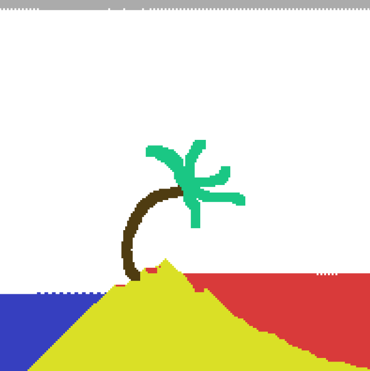

# Cellumatron (A cellular automata sandbox)

## Quick start

You can run it locally by running

```console
$ npm run dev
```

Or through github pages via this [Link](https://jaqee-a.github.io/cellumatron/)

## References

> - **Cellular Automata**: https://en.wikipedia.org/wiki/Cellular_automaton

## Functionalities

- ✅ Create new elements and setup rules/actions
- ✅ Defining rules/actions in a 3x3 matrix
- ✅ Updating rules/actions in realtimeTodo

## Todo (not sorted)

> NOTE: All tasks with ✅, means they are all already done and will probably delete them from todo sooner or later

- A more appealing UI/UX
- Make a customized tools bar
- Make more tools for drawing on canvas
- Create a menu to clear the canvas and create new canvas with custom size
- Add GPU support
- Add multi element color
- Add randomized set of rule clusters
- Add dynamic neighbours in rules (can set one the neighbour to any element or multiple elements in one cluster)
- Add support for bigger rules/actions matrices
- Add support for rules based on the number of neighbours

## Gallery



